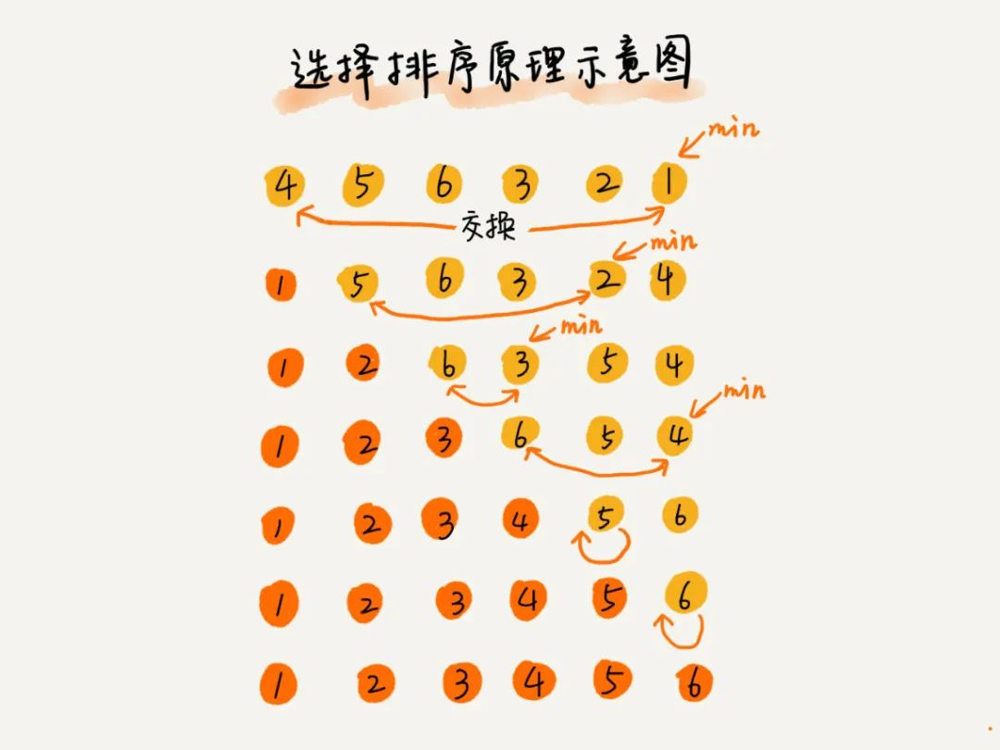

# 排序

| 排序算法 | 是否原地排序 | 是否稳定 | 平均时间复杂度 | 最好 | 最坏 |
|:-- |:-- |:-- |:-- |:-- |:-- |
|冒泡 | true | true | O(n^2) | O(n) | O(n^2)|
|插入 | true | true | O(n^2) | O(n) | O(n^2)|
|选择 | true | false | O(n^2) | O(n^2) | O(n^2)|
|归并 | false | true | O(nlogn) | O(nlogn) | O(nlogn) |
|快排 | true | false | O(nlogn) | O(nlogn) | O(n^2) |
|堆排序 | true | false | O(nlogn) | O(nlogn) | O(nlogn) |
|桶排序 | false | true | O(n) | O(n) | O(nlogn) |
|计数排序 | false | true | O(n+k) | O(n+k) | O(n+k) |
|基数排序 | false | true | O(kn) | O(kn) | O(kn) |

## 快速排序

对于快速排序，全部参考于 https://blog.csdn.net/Holmofy/article/details/71168530

快排的基本思想：根据某个值将数据 分组，<= 全部左边， > 全部右边

双向 相比于 单向，能够减少很多 不必要的交换

分三组 主要解决的是 许多重复的问题，能减少很多次 交换、循环

双轴 是效率更高的一种，同样的一次遍历，比单轴 分了更多组，落实到最后 就是 遍历 lg2 和 lg3 次的区别。

Arrays.sort底层使用的也是DualPivotQuickSort，这个类对双轴快排在策略上进行了一个改动（不仅仅是双轴快排，还是用到了其他的排序，如直接插入排序，对于byte，char，short基本类型还用到了计数排序）

1 普通快速排序
2 双向交换
3 双向覆盖

4 单向扫描 分组
5 单向 分3组
6 双向扫描 分组
7 双轴

 

## 选择排序

**不是个稳定的排序算法。**

其他排序 参考与：https://blog.csdn.net/holmofy/article/details/70245895